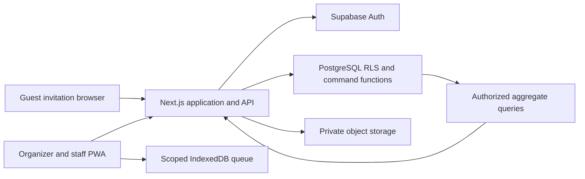

# Architecture and decisions

Status: proposed. A single modular Next.js application with PostgreSQL is sufficient for the MVP. Avoid microservices and a second identity provider.



## Decisions

| Decision      | Choice and reason                                                           | Tradeoff                                                                                      |
| ------------- | --------------------------------------------------------------------------- | --------------------------------------------------------------------------------------------- |
| Identity      | Supabase Auth; email/password with verified email and invitation onboarding | Configure email delivery; require MFA for privileged production accounts                      |
| Authorization | Live DB memberships, event permissions and gate assignments                 | More checks per request; immediate online removal is more valuable than stale JWT role caches |
| Application   | Next.js App Router, strict TypeScript, server routes, schema validation     | Server-only boundaries must be checked in builds                                              |
| UI            | Tailwind plus accessible Radix-based controls                               | Validate real device scanner layout and assistive technology                                  |
| Database      | PostgreSQL constraints, RLS, transactional command boundary                 | SQL integration tests are mandatory                                                           |
| QR            | Candidate qrcode generator and qr-scanner camera library                    | Device spike required; do not rely solely on native BarcodeDetector                           |
| PWA           | Service worker shell + IndexedDB queue                                      | Offline revocation and cross-device state cannot be immediate                                 |
| Reporting     | Server-side CSV/XLSX/PDF, private stored exports                            | Large jobs need asynchronous processing and bounded memory                                    |
| Live metrics  | Authorized polling initially, ≤5-second freshness target                    | Simpler than Realtime; can add scoped aggregate broadcasts later                              |
| Deployment    | Vercel web + managed Supabase                                               | Verify current quotas, function limits, regions and commercial cost before provisioning       |

## Database access boundary

Use user-scoped Supabase clients for ordinary authorized queries. Keep sensitive guest contact data and token material in a non-exposed schema. No direct browser grants to raw contact, token, attendance state, transaction or audit tables. A narrow public RPC wrapper can invoke a private command routine; revoke PUBLIC/anon execute and explicitly grant only intended callers. If SECURITY DEFINER is needed for atomic protected writes, use a minimally privileged owner, fixed safe search_path, qualified objects and explicit auth.uid(), active session, tenant, event, permission and gate checks inside the routine. Do not trust actor IDs sent by clients. Test direct RPC calls as hostile clients. Use SECURITY INVOKER for ordinary queries where possible.

Public token resolution uses a separate server-only restricted database capability with no broad tenant enumeration. Avoid using service-role access as the default application data path. If an administrative job needs privileged access, isolate and audit it. Tenant context is derived from verified identity and membership, never solely from URL or client input.

## Repository layout after approval

```text
src/app/                 routes, pages and API handlers
src/features/            events, guests, invitations, attendance, reports
src/lib/                 shared validation and pure domain rules
src/server/              auth, database adapters, tokens, audit, exports
public/                  manifest, service worker and static assets
supabase/migrations/     versioned schema, constraints, grants and RLS
supabase/tests/          database authorization and invariant tests
tests/unit/              pure calculations and validation
tests/integration/       real database commands, concurrency and replay
tests/e2e/               browser journeys
.github/workflows/       lint, types, tests, build and migration validation
docs/                    product and implementation contracts
```

## Sources checked

Reviewed 22 September 2026. Dependency versions will be selected, security-checked and pinned when installing, not guessed in this design.

- [Next.js App Router](https://nextjs.org/docs/app): routing and server application structure.
- [Supabase SSR](https://supabase.com/docs/guides/auth/server-side/creating-a-client): separate server/browser clients and verified server auth.
- [Supabase RLS](https://supabase.com/docs/guides/database/postgres/row-level-security): row authorization plus explicit grants.
- [Data API default changes](https://supabase.com/changelog/45329-breaking-change-tables-not-exposed-to-data-and-graphql-api-automatically): include grants deliberately in migrations.
- [Supabase changelog](https://supabase.com/changelog): reviewed relevant recent changes; do not modify managed realtime schema or assume auth email customization is available on every plan.
- [PostgreSQL locking](https://www.postgresql.org/docs/current/explicit-locking.html): row locks serialize competing invitation commands.
- [QR scanner](https://github.com/nimiq/qr-scanner) and [QR generation](https://github.com/soldair/node-qrcode): candidate libraries, subject to device and dependency validation.
