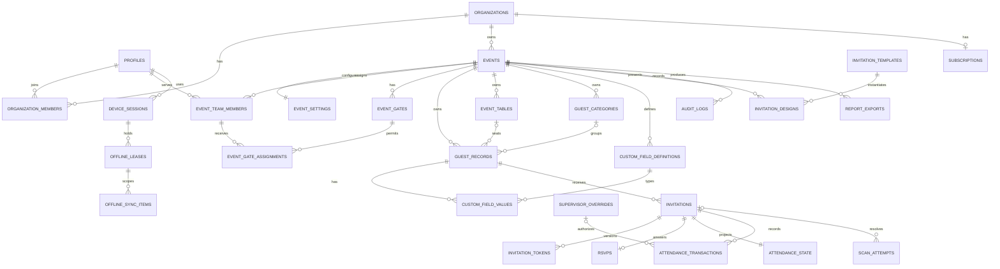

# High-level entity relationships

Logical model; all event-owned relationships use composite tenant/event foreign keys as specified in [Database](DATABASE.md).

Idempotency requests, import jobs, notification records, platform admins and granular permission grants are support tables omitted from this overview for readability; see the full catalog.
